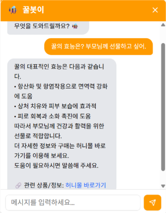
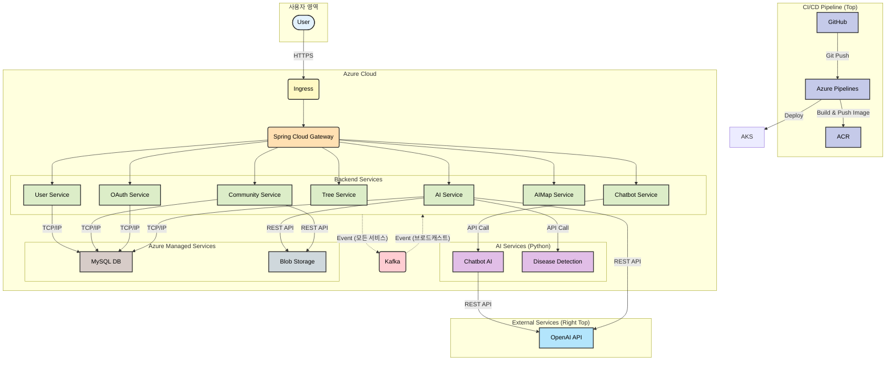

# **Forbee: AI 기반 스마트 양봉 통합 관리 플랫폼**

**한국양봉농협의 B2B 파트너로서, 데이터와 AI 기술을 통해 양봉 산업의 지속 가능한 성장을 지원합니다.**

<br>

[](https://www.canva.com/design/DAGwfn68TnI/abHI92WRBfvELwVGMXbOmA/edit?utm_content=DAGwfn68TnI&utm_campaign=designshare&utm_medium=link2&utm_source=sharebutton) [](https://www.youtube.com/watch?v=CjDmEf62XXg)

<br>

## ✨ 프로젝트 소개 (Introduction)

최근 기후 변화와 값싼 수입 꿀의 유입으로 인해 국내 양봉 산업은 큰 어려움을 겪고 있습니다. 이는 양봉 농가의 수익성 악화는 물론, 조합원을 기반으로 운영되는 **한국양봉농협**의 비즈니스에도 직접적인 위협이 되고 있습니다.

**Forbee**는 이러한 문제를 해결하기 위해 탄생한 B2B 솔루션입니다. 저희는 양봉농협에 AI 기반의 혁신적인 서비스를 제공하여, 양봉 농가의 생산성을 향상시키고 신규 조합원을 유치할 수 있는 강력한 도구를 제공합니다. 이를 통해 양봉 산업의 진흥과 양봉농협의 동반 성장을 목표로 합니다.

<br>

### 📚 목차 (Table of Contents)
1. [주요 기능](#-주요-기능-key-features)
2. [기술 스택](#-기술-스택-tech-stack)
3. [아키텍처](#-아키텍처-architecture)
4. [시작하기](#-시작하기-getting-started)
5. [배포](#-배포-deployment)
6. [팀원 소개](#-팀원-소개-team)

<br>

## 📸 주요 기능 (Key Features)

### 🌸 **밀원수 개화 시기 예측**
- 전국 관측소의 40년치 기상 데이터와 개화 데이터를 학습한 AI 모델(PyTorch, Scikit-learn 기반)이 아카시아, 유채꽃 등 주요 밀원수의 올해 개화 시기를 예측합니다.
- 양봉 농가는 이를 통해 약 40일 전부터 시작되는 채밀 준비를 최적의 시점에 시작할 수 있습니다.

> `[스크린샷 삽입: 전국 지도 위에 밀원수별 예상 개화일이 표시된 화면]`

### 🗺️ **최적 양봉 입지 분석**
- 이동 양봉 농가를 위해, 지도에서 선택한 지역의 양봉 적합성을 이미지 기반(OpenCV, PyTorch)으로 분석합니다.
- 위성 사진을 분석하여 반경 800m 내의 논, 밭 등 농약 위험 요소를 식별하고, LLM이 종합적인 입지 분석 보고서를 생성합니다.

> `[스크린샷 삽입: 지도에서 지역을 선택하고 분석 결과 보고서가 표시된 화면]`

### 🩺 **질병/해충 진단 및 AI 리포트**
- 양봉 농가가 벌통 내부 사진을 업로드하면, **YOLO(Ultralytics)** 기반의 AI가 꿀벌 응애, 낭충봉아부패병 등 주요 질병 및 해충을 신속하게 진단합니다.
- 진단 결과를 바탕으로 **LangChain**과 **RAG** 기술을 활용한 AI가 즉각적인 대응 방안을 포함한 상세 리포트를 제공하여 초기 대응을 돕습니다.
- 궁금한 점은 AI 챗봇으로 실시간으로 문답을 이어갈 수 있습니다.
- 더 전문적인 소견이 필요할 경우, 'QnA 작성하기' 버튼을 통해 커뮤니티에 질문을 올리면 양봉농협 소속 꿀벌 전문 수의사가 직접 답변을 제공합니다.

> `[스크린샷 삽입: 질병 탐지 리포트 기반 대화가 표시된 화면]`

### 👀. 커뮤니티 및 꿀벌 챗봇

- **게시판:** 양봉 농가들이 자유롭게 소통하는 `자유게시판`, 농협의 중요 소식을 전하는 `공지사항`, 전문가의 답변을 받는 `Q&A 게시판`을 제공합니다.
- **꿀벌 챗봇:** **RAG(Retrieval-Augmented Generation)** 와 **Chroma DB**를 활용하여 꿀벌 관련 전문 지식부터 사이트 이용 방법, 양봉농협 금융 상품 안내까지 다양한 정보를 제공합니다.



<br>

## 🛠️ 기술 스택 (Tech Stack)

| 구분 | 기술 |
| :--- | :--- |
| **Frontend** | **Next.js (React)**, Axios, Tailwind CSS |
| **Backend** | Java 11, **Spring Boot**, **Spring Cloud Gateway**, Python 3.9, **FastAPI** |
| **AI** | **PyTorch**, **YOLO (Ultralytics)**, **LangChain**, **RAG**, Scikit-learn, OpenCV, OpenAI API |
| **Database** | **Azure Database for MySQL**, **Chroma DB** (Vector DB) |
| **Infra & DevOps** | Docker, Kubernetes, **Kafka**, Nginx, JWT, **Azure Blob Storage**, Azure Pipelines |

<br>

## 🏗️ 아키텍처 (Architecture)

본 프로젝트는 각 AI 기능의 높은 부하와 독립적인 개발/배포를 고려하여 **마이크로서비스 아키텍처(MSA)** 로 설계되었습니다.



- **Gateway (`/gateway`):** 모든 마이크로서비스의 진입점 역할 및 라우팅 (Spring Cloud Gateway)
- **OAuth (`/oauth`):** JWT 기반의 통합 인증 및 인가 (Spring Security)
- **User (`/user`):** 사용자 정보 관리 (Spring Boot, MySQL)
- **Tree (`/tree`):** 개화 시기 예측 서비스 (Spring Boot, Python/PyTorch)
- **AIMap (`/aiMap`):** 양봉 입지 분석 서비스 (Spring Boot, Python/OpenCV)
- **AI & AI-Python (`/ai`, `/ai_python`):** 질병/해충 진단 서비스 (Spring Boot, FastAPI, YOLO, LangChain)
- **Community (`/community`):** 게시판 서비스 (Spring Boot, MySQL)
- **Chatbot & Chatbot-AI (`/chatbot`, `/chatbot_ai`):** AI 챗봇 및 정보 제공 (Spring Boot, FastAPI, RAG)
- **Infra (`/infra`):** Kafka 등 인프라 실행 환경 구성

<br>

## 🚀 시작하기 (Getting Started)

### Prerequisites
- Java 11+
- Node.js 18+
- Docker & Docker Compose
- Python 3.9+

### Installation & Execution
1.  **저장소 복제**
    ```shell
    git clone [Your Repository URL]
    cd forbee
    ```
2.  **환경 변수 설정**
    - 각 서비스 디렉토리의 `.env.example` 또는 `application.yml` 파일을 참고하여 DB, JWT, Azure, OpenAI API Key 등의 환경 변수를 설정합니다.
3.  **Docker Compose로 전체 서비스 실행**
    ```shell
    이건 하나하나 다 작성해야함. 너무귀찮아 너무귀찮아 너무귀찮아.
    ```

<br>

## 🚀 배포 (Deployment)

본 프로젝트는 Azure 클라우드 환경에 Kubernetes를 기반으로 배포되었습니다. 모든 배포 과정은 Azure Pipelines를 통해 CI/CD 파이프라인으로 자동화되어 있습니다.

### 1. 핵심 전략
- **Containerization**: 모든 마이크로서비스는 Docker 컨테이너 이미지로 빌드되어 일관된 실행 환경을 보장합니다.
- **Orchestration**: Kubernetes를 사용하여 컨테이너화된 애플리케이션을 안정적으로 배포하고 확장, 관리합니다. 각 서비스의 배포 및 네트워크 설정은 `/kubernetes` 디렉토리 내의 `deployment.yaml`, `service.yaml` 파일에 정의되어 있습니다.

### 2. CI/CD 파이프라인 (Azure Pipelines)
- **Source & Trigger**: `release` 브랜치에 코드가 Push되면 자동으로 파이프라인이 실행됩니다.
- **Build & Test**: 각 서비스(Spring Boot, Next.js, Python)의 소스 코드를 빌드하고 테스트를 수행합니다.
- **Dockerize & Push**: 빌드가 완료된 애플리케이션을 Docker 이미지로 만들어 Azure Container Registry(ACR)에 Push합니다.
- **Deploy to AKS**: ACR에 Push된 최신 버전의 이미지를 Azure Kubernetes Service(AKS) 클러스터에 배포하여 서비스를 업데이트합니다.

### 3. 실행 환경
- **Cloud Platform**: Microsoft Azure
- **Container Orchestrator**: Azure Kubernetes Service (AKS)
- **Container Registry**: Azure Container Registry (ACR)
- **Database**: Azure Database for MySQL
- **Storage**: Azure Blob Storage

### 4. 도메인 등록
- Azure Kubernetes Service에 배포된 Ingress Controller의 외부 IP 주소를 확인합니다.
- 구매한 `forbee.me` 도메인의 DNS 설정에서, 해당 외부 IP 주소를 A 레코드로 추가하여 도메인과 서비스를 연결했었습니다.
- 현재는 **비용 이슈**로 인하여 서버를 닫아 놓은 상태입니다. ~~Azure VM 너무비싸~~

<br>

## 👨‍💻 팀원 소개 (Team)

| | 👑 팀장 👑 | 팀원 1 | 팀원 2 | 팀원 3 | 팀원 4 |
| :---: | :---: | :---: | :---: | :---: | :---: |
| **이름** | 이재승 | 김보라 | 이태현 | 전임록 | 최미소 |
| **프로필** |  |  |  |  |  |
| **역할** | 개화시기 예측 (예측 모델)<br>양봉입지 분석 (이미지 분석) | 질병/해충 탐지 에이전트(LLM & RAG) 및 페이지 설계<br> | 질병/해충 탐지 (이상 탐지)<br>배포 (CICD) | 계정 (JWT&Spring Boot)<br>프론트엔드 (React)<br>배포 (Azure & Kubernetes) | 챗봇 (LLM & Agent & RAG)<br>커뮤니티 페이지 설계<br>클라우드 인프라 프로비저닝 및 IAM/RBAC 권한 관리(DevOps/플랫폼 엔지니어링) |
| **GitHub**| [@fndl5759](https://www.github.com/fndl5759) | [@cucumberbatc](https://www.github.com/cucumberbatc) | [@thlee17](https://www.github.com/thlee17) | [@dlafhr789](https://www.github.com/dlafhr789) | [@Mnemosyne1234](https://www.github.com/Mnemosyne1234) |

<br>

1. [주요 기능](#-주요-기능-key-features)
2. [기술 스택](#-기술-스택-tech-stack)
3. [아키텍처](#-아키텍처-architecture)
4. [시작하기](#-시작하기-getting-started)
5. [배포](#-배포-deployment)
6. [팀원 소개](#-팀원-소개-team)
